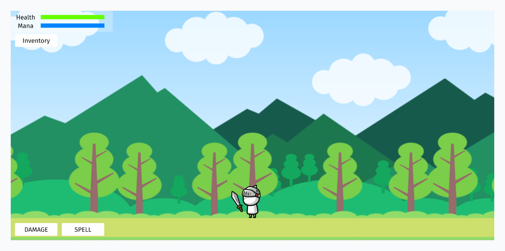
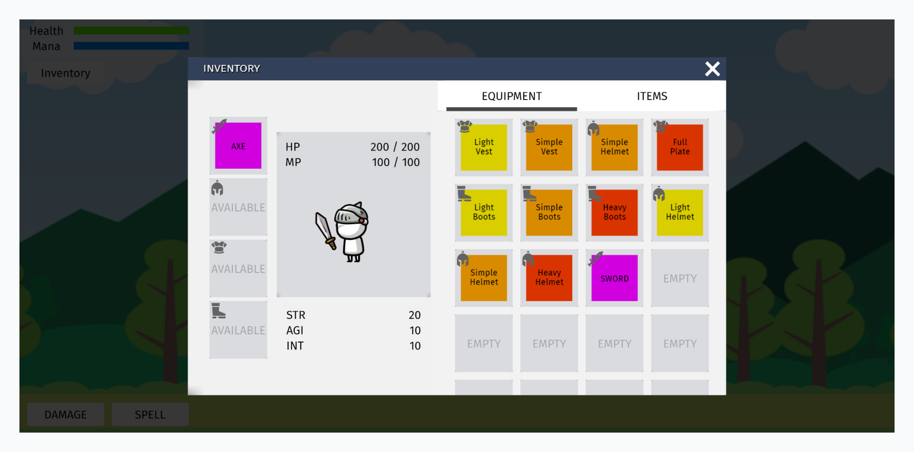

# Tatsu Cocos Technical Test - Inventory System

This repository contains the source code for the technical test, which implements a basic RPG-style inventory system for a playable character. The project was built using Cocos Creator 3.8.6.

Playable Demo: [https://tatsu-inventory.pages.dev/](https://tatsu-inventory.pages.dev/)

## Table of Contents

- [Project Description](#project-description)
- [Features](#features)
- [Getting Started](#getting-started)
- [Asset and Data Modification](#asset-and-data-modification)
- [Built With](#built-with)

## Project Description

The goal of this project is to create a simple yet functional equipment and inventory system for a playable character for RPG game. The system allows the player to manage equipment, view character stats, and consume items. The primary focus is on data management and UI implementation to create a responsive and intuitive user experience.





## Features

- **Character Stats:**
    - The character possesses core stats: Health, Mana, Strength, Agility, and Intelligent.

- **Equipment System:**
    - The character has dedicated equipment slots: Weapon, Helmet, Armour, and Boots.
    - Equipping items enhances the character's base stats.
    - Visual feedback for equipment slot (scale effect) and stats text (gradually change) when equip is triggered.

- **Inventory System:**
    - A simple inventory allows players to view and manage their items.
    - Players can equip item or consume item by double taps or double clicking the slot.
    - Players can move equipment or item slots by tapping or clicking once on the item slot to select it, then tap or click another slot to complete the move.

- **Dynamic UI:**
    - A clear and responsive UI displays the character's current Health, Mana, and other stats.
    - Stat displays update in real-time as equipment changes.
    - An interactive tooltip appears when hovering over items, showing their details and stats.

- **Character Interaction:**
    - Placeholder buttons are provided to simulate taking damage or using mana, allowing for testing of consumable items.

## Getting Started

To run this project locally, you will need to have Cocos Creator installed.

1. **Clone the repository:**

    ```sh
    git clone [https://github.com/kenlimzx1/tatsu-inventory.git](https://github.com/kenlimzx1/tatsu-inventory.git)
    ```

2. **Open the project in Cocos Creator:**
    - Launch Cocos Creator.
    - From the dashboard, select **Open** and navigate to the cloned repository folder.

3. **Run the project:**
    - Once the project is loaded, navigate to `scenes` folder and select `initScene.scene`

## Asset and Data Modification

You can easily modify assets, as the project uses an Asset Bundle system. Navigate to the `data` folder to add or update assets directly.

To change the initial player inventory values, open gameScene.scene and locate the `InventoryManager` node. From there, you can adjust the `CurrentEquipmentSlots` and `CurrentConsumableSlots` as needed.

Additionally, player stats can be modified by accessing the `prefabs\Character` directory and editing the character stats directly within the prefab.

## Built With

- **[Cocos Creator](https://www.cocos.com/en/creator) v3.8.6**
